# NetLand
A comprehensive tool for simulation and visualization of transcriptional network kinetics

NetLand is open-source software for modeling and simulating the kinetic dynamics of transcriptional regulatory networks. 

The global system dynamics which determine cell state transition are abstracted from transcriptional regulations and visualized in Waddington’s epigenetic landscape. It provides flexible simulation methods and landscape implementations, i.e. probabilistic landscape representing the stability of cells. The landscape can be visualized by mapping to two marker genes or a two-dimensional latent space by using a dimension reduction method, GPDM. 

# Documentary 
The software NetLand is written in Java, with a graphical user interface (GUI).
This page describes how to install and gives some examples of use of NetLand.

### Release Information
Current release is 1.0.

### Installation
The Java Platform, Standard Edition Runtime Environment (JRE) is required to be installed (Java SE is available at http://java.com/en/download/inc/windows_upgrade_ie.jsp). We have tested NetLand under Window 7/10, Linux Fedora 18 and Mac OS 10.8.  

The current NetLand package includes the following files.

  1) One executable file, namely “NetLand.jar”. User can double click on this file to launch NetLand. 
  
  2) Two folders namely “toy models” and “saved results” which contain toy gene network files and pre-computed results respectively. 
  
  3) A folder namely “GPDM” which contain the executive files are required for running “GPDM” program in NetLand. Note that the “NetLand.jar” file must be in the same directory as the “GPDM” folder. Make sure you have the executive permissions to the executive files. To check the permission, the command is `ls –l XXX` in Linux/Mac OS. Use `sudo chmod 705 filename` to gain the executive permission. 
  
  To run the “GPDM” program, DLL (Dynamic Link Library) of BLAS, LAPACK and GFORTRAN are required. The DLL files for Windows OS are in the GPDM/win folder. For Mac OS, please check if libblas.dylib, liblapack.dylib and libgfortran.dylib are under /usr/lib/. Otherwise users should install the libraries themselves. 
  
  The BLAS, LAPACK and GFORTRAN can be downloaded from 
    
      •	LAPACK, see http://www.netlib.org/lapack/ 
      
      •	BLAS, see http://www.netlib.org/blas/ 
      
      •	GFORTRAN, see https://gcc.gnu.org/wiki/GFortranBinaries#MacOS 
  Then follow the install instructions in the package. For Linux, users can use the command, e.g. yum, to install these packages.   

## File operation
### Loading files
NetLand can load network structure files (TSV, GML, DOT) or dynamic models (e.g. in format of SBML). 

TSV is a file extension for a tab-delimited file used with spreadsheet software. TSV stands for Tab Separated Values. TSV files are used for raw data and can be imported into and exported from spreadsheet software. TSV files are essentially text files, and the raw data can be viewed by text editors, though they are often used when moving raw data between spreadsheets.

Graph Modeling Language (GML) is a hierarchical ASCII-based file format for describing graphs. It has been also named Graph Meta Language.

DOT is a plain text graph description language. It is a simple way of describing graphs that both humans and computer programs can use. 

The Systems Biology Markup Language (SBML) is a representation format, based on XML, for communicating and storing computational models of biological processes. It is a free and open standard with widespread software support and a community of users and developers. SBML can represent many different classes of biological phenomena, including metabolic networks, cell signaling pathways, regulatory networks, infectious diseases, and many others. It is the standard for representing computational models in systems biology today. For more information of SBML, please refer to http://sbml.org/Main_Page. 

### Saving networks
NetLand can automatically convert the regulatory interactions in a network into a dynamic model. This constructed model can be saved in SBML files. The structure of network can be saved in TSV files as well. 

### Load saved results
NetLand can load saved simulation results, e.g. a time-course plot and a constructed landscape. These results can be generated when performing the simulation by identifying the saving path and filename. After it is successfully generated, users can load them in further analysis. When loading the result, the dynamic model, the results and simulation environment will all be recovered.

## Modification of the network
NetLand provides flexible ways to load and modify a transcriptional network. 

### Block nodes
The nodes in a gene network can be blocked to simulate the gene knockout experiment. By clicking the “Block nodes” item in “Network” menu or the relative function in the top button bar, a dialog with a gene list will be pop-up (figure below). After moving the blocked genes to the right list, the reactions of the remaining genes should be modified when they contain removed nodes as regulators.  

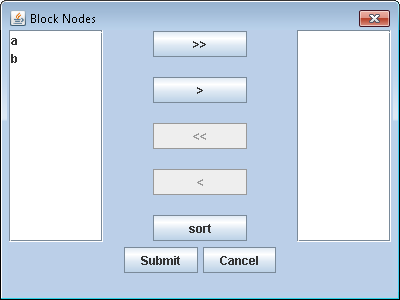 
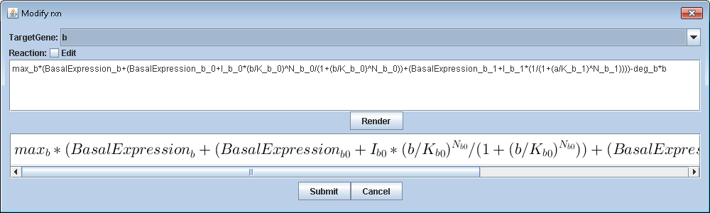 
The pane for blocking nodes.
 

### Add nodes/Edges
Compared to blocking functions, users can add new genes and edges to build new regulatory interactions. By clicking the “Add nodes/edges” item in “Network” menu or the relative function in the top button bar, a dialog will be pop-up (figure below). Once you add a new gene, a set of parameters should be verified including initial value, degradation rate etc.. The new regulatory relations (edges) are encoded as Hill equations and added to the target genes’ original formulas.  

 
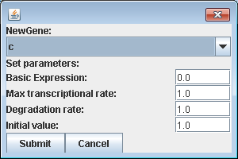 
The pane for adding nodes and edges.
 

## Generation of the dynamic model
Species, reactions and parameters constitutes the three main components of a dynamic model. During conversion of the transcriptional network to the dynamic model or loading a SBML file, the initial values of genes and parameters in reactions are assigned by a default number or read from the SBML file. 

The reactions can be easily modified by clicking the button in the “Reaction” Panel (figure below). Similarly the values of genes and parameters can be directly modified in the panel view. 

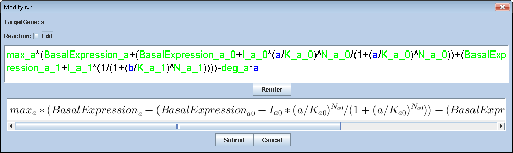 
The panels for species, reactions and parameters of the dynamic model.
 

## Simulation analysis
NetLand is applicable to the study of GRN kinetics. Through in silico simulation, the dynamics of the GRN can be visualized in multiple ways, e.g. trajectories and Waddington’s epigenetic landscape. 

### Generation of trajectories
The transcriptional network can be encoded in deterministic models or stochastic models (figure below). The 5th order Runga-Kuta method is used to solve ODEs. Gillespie algorithm is used to simulate the stochastic processes. SDEs are numerically solved by the Euler-Maruyama method. 

It provides multiple simulations within defined time range. By control of the noise strength in SDEs, users can study the influence of noises in transcriptional processes. For the simulation, there are two choices for setting of the initial values of genes, i.e. fixed or random. The fixed initial values are defined in the species panel, while users can define the range of random numbers as initial values. Individual simulated data can be retrieved by the function buttons on the top of the figure. The steady states of multiple trajectories can be analyzed by clicking the “Analyze result” button. It will show the steady states and percentages of the current simulation. 

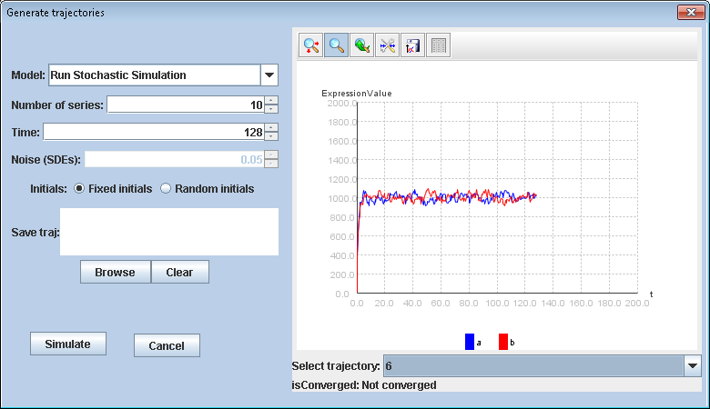 
The pane for generation of trajectories.
 

### Construction of landscapes
The implementation of probabilistic Waddington’s epigenetic landscape is provided in NetLand. NetLand adopted the self-consistent mean field approximation method in (Li and Wang, 2013) to construct the probabilistic landscape. The probabilistic landscape is based on the notion that the probability of gene expression states determines the stability.

The expression levels of two marker genes are selected as x-axis and y-axis in the landscape with potential U as z-axis. To avoid the loss of information, a probabilistic dimension reduction method, Gaussian process dynamical model (GPDM) is employed to project high dimensional gene expression time-series data to a low dimensional latent space with a dynamical model.

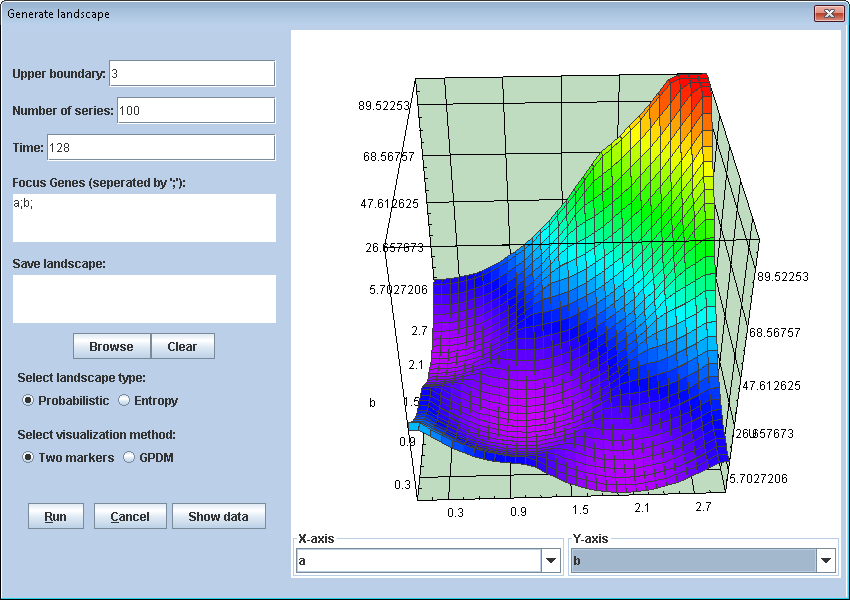 
The pane for the construction of landscape.
 

If GPDM is selected as the visualization method, the x-axis and y-axis are two constructed components. On the contrary, users can select the coordinate from the gene list. Once the landscape is plotted, a “Show data” button is shown next to the “Cancel” button. The detailed elevations, coordinates in the landscape and gene expression values can be accessed by double click the blocks in the figure below. 

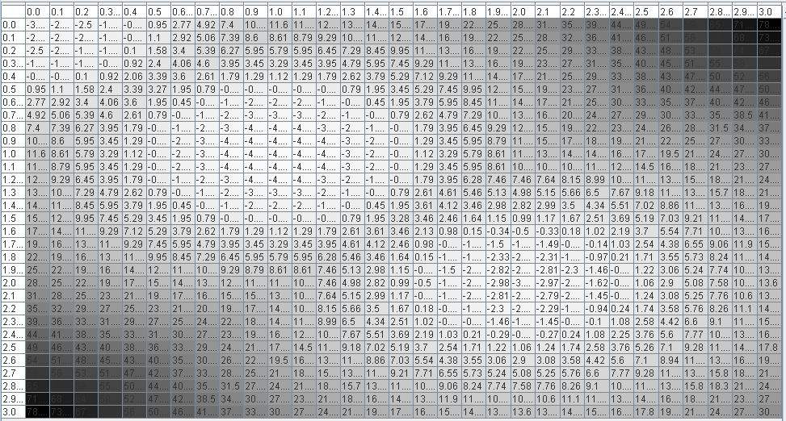 
The data of the constructed landscape.
 

## Examples
To study the stem cell reprogramming process, a computational model, ‘seesaw model’ with 4 genes (figure below) was constructed in (Li and Wang). NetLand was applied to simulate and analyze the model. 

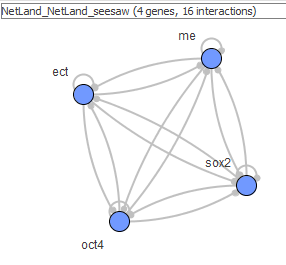 
A seesaw model used to simulate differentiation and reprogramming.
 

First, the regulatory relations between genes were extracted into a TSV format file. After loading it to NetLand, the differential equations would be updated according to the paper including the parameters. Once the dynamic model was settled, further analysis and simulation can be performed based on this model. 

### Sensitivity analysis 
####1) Parameter KM=0
When the value of Klf4 and MYC is set to be 0, the cells cannot maintain their pluripotency to start differentiation. There will be two attractors left in the landscape representing ME and ECT states. 

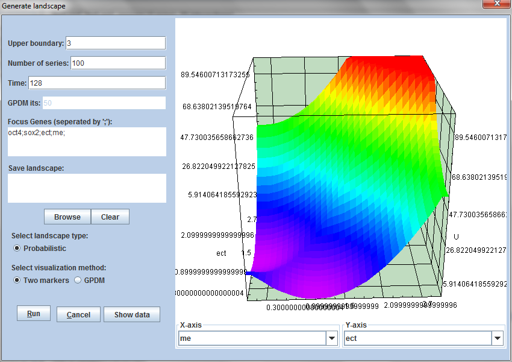 
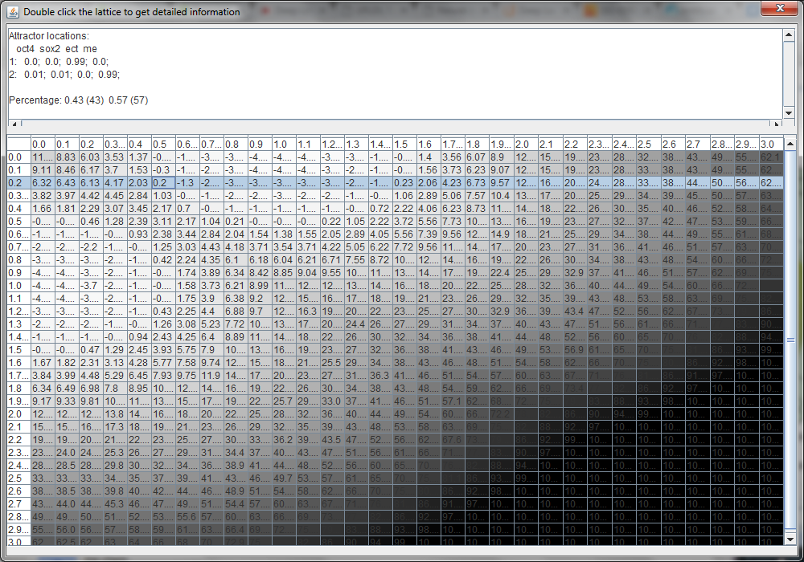 
Landscape with two attractors when KM=0.
 

####2) Parameter KM=0.4
Besides two attractors, there will be an additional state representing stem cell state. 

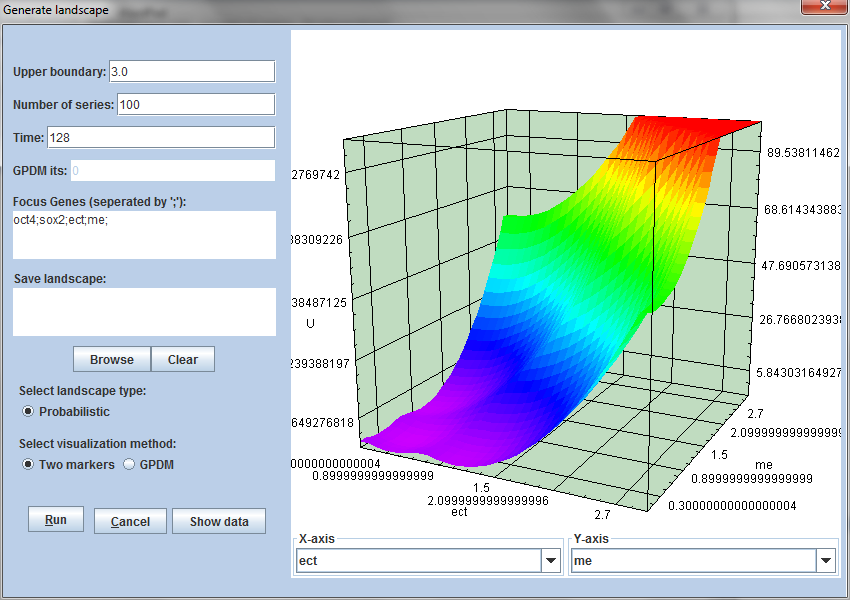 
Landscape with three attractors when KM=0.4.
 

####3) Reprogramming experiment with different cocktails
  
  <b>3.1 +Sox2</b>
  
  With the replenishment of Sox2, the ME lineage will all change into the ECT lineage. There are two attractors left, i.e. stem cell state and ECT state. 
  
  
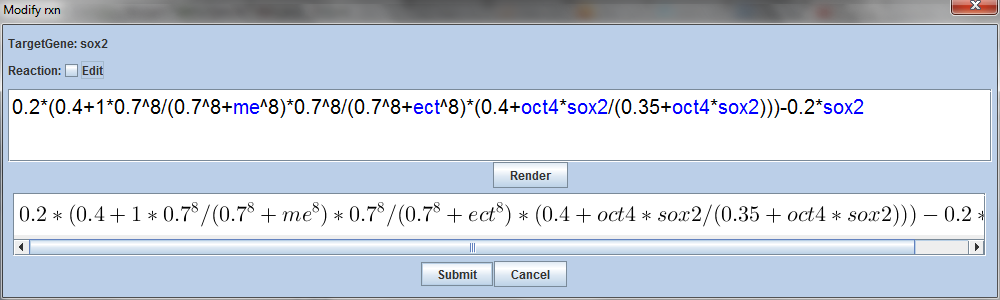 
  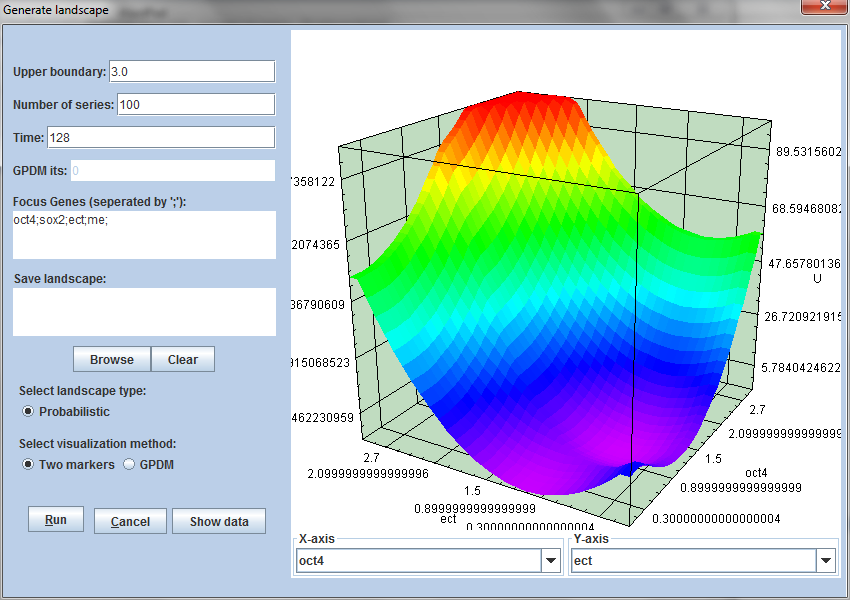 
Landscape with two attractors when Sox2 is overexpressed.
 
  
  To check whether all ME cells goes into ECT lineage, we set the initial state as ME state and made use of the analyze function in trajectories simulation. It shows all ME cells turned into ECT state (figure below). 
  
  
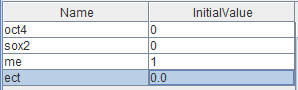 
  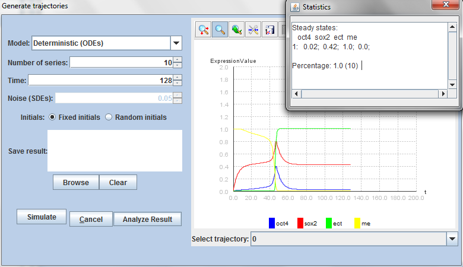 
  
 
  
  <b>3.2 +Yamanaka's factors (+Sox2+Oct4)</b>
  
  In this experiment, the somatic cells will be reprogrammed into iPSCs (similar to stem cells). 
  
  
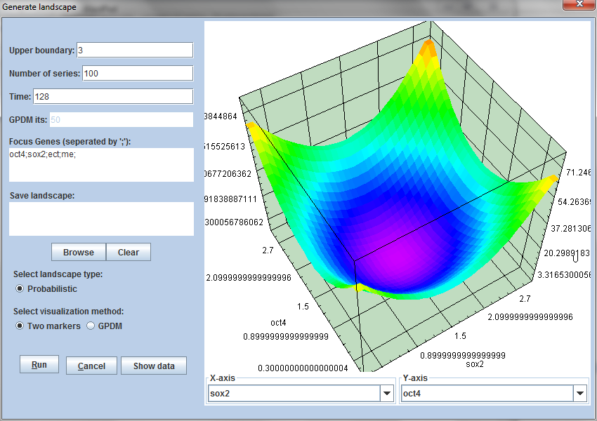 
   
  
 
  
  <b>3.3 +Lineage specifiers (+ME+ECT)</b>
  
  In this experiment, ME and ECT work as the substitution of Oct4 and Sox2. The somatic cells will be reprogrammed into iPSCs (similar to stem cells). 
  
  
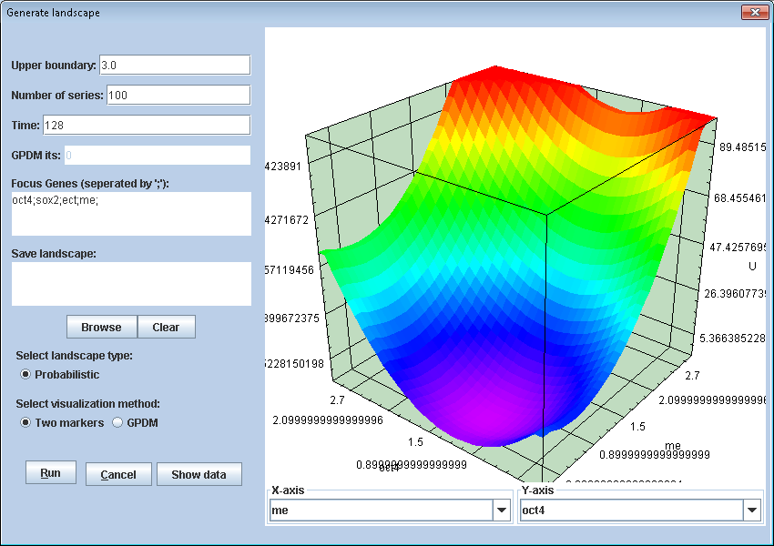 
  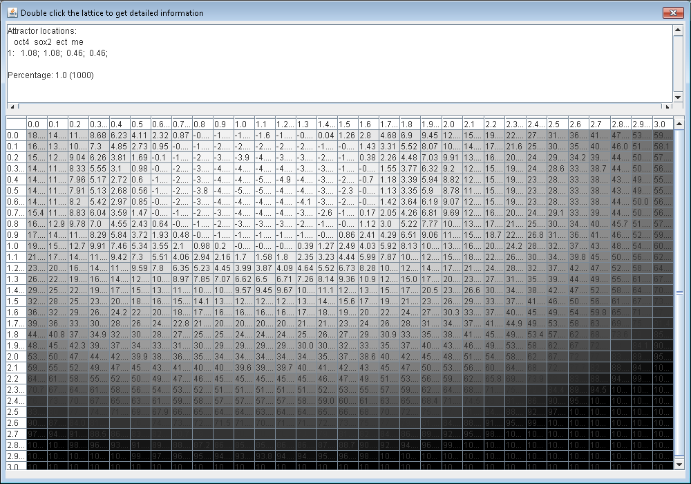 
  
 

